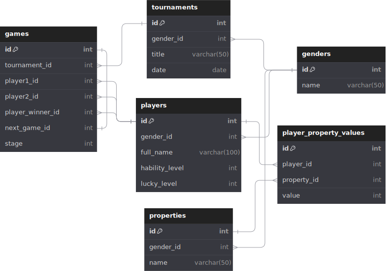

# Tennis Tournament Challenge 🎾

## Descripción
Este es un proyecto challenge backend realizado para GeoPagos.

## Autor

Agustín Durán

- GitHub: https://github.com/agustinduran
- LinkedIn: https://www.linkedin.com/in/agustineduran/

## Tabla de Contenidos

- [Modelado de Datos](#modelado-de-datos)
- [Tecnología](#tecnología)
- [Pre Requisitos](#pre-requisitos)
- [Patrón de Arquitectura](#patrón-de-arquitectura)
- [Instrucciónes](#how-to-install)
- [Ejecución](#run)
- [Rutas](#routes)

## Modelado de Datos



### Justificaciones de Diseño

Para resolver este desafío opté por tener desacoplado los valores de las propiedades (player_property_values) con respecto a la definición de las propiedades (properties), aquí van a poder estar las propiedades del tipo (Fuerza, Tiempo de Reacción, etc.). Por motivos de extensibilidad decidí no implementar el género en la tabla de propiedades, se deberá evaluar a nivel backend.

El torneo estará compuesto por partidos (games), los cuáles tendrán una etapa definida (stage), el cuál: 0 será la etapa de final, 1 semifinal, 2 cuartos, y así sucesivamente... Estos partidos contarán con un enlace al siguiente partido dentro del cuadro, de manera que se podrá saber quien podría jugar contra quién de los próximos encuentros. Una vez obtenido al  ganador del partido, este se almacenará en el atributo de player_winner_id.

Para obtener el ganador del torneo simplemente se debe hacer una intersección entre la tabla games y tournament, con stage 1 obteniendo su player_winner_id.

## Tecnología

* Programming languange: PHP 8.1.19
* App Framework: Symfony 6.4.*
* Database engine: MariaDB

## Pre requisitos

* Symfony 6.* con PHP 8.1.*
* Composer instalado
* Linux/Mac terminal (O emular linux en Windows)
* No poseer servicios corriendo en localhost puertos 8000 o 3306

## Patrón de Arquitectura

Se ha implementado una arquitectura hexagonal con algunos principios del DDD.

```scala
src/
├── Application/
│   ├── Command/
│   ├── Query/
│   ├── Service/
│   │   └── [...]
│   └── DTO/
├── Domain/
│   ├── Model/
│   │   ├── Gender.php
│   │   ├── Tournament.php
│   │   ├── Player.php
│   │   ├── Property.php
│   │   ├── PlayerPropertyValue.php
│   │   └── Game.php
│   ├── Repository/
│   │   ├── GenderRepository.php
│   │   ├── TournamentRepository.php
│   │   ├── PlayerRepository.php
│   │   ├── PropertyRepository.php
│   │   ├── PlayerPropertyValueRepository.php
│   │   └── GameRepository.php
│   ├── Service/
│   └── ValueObject/
└── Infrastructure/
    ├── Doctrine/
    │   ├── DoctrineGenderRepository.php
    │   ├── DoctrineTournamentRepository.php
    │   ├── DoctrinePlayerRepository.php
    │   ├── DoctrinePropertyRepository.php
    │   ├── DoctrinePlayerPropertyValueRepository.php
    │   └── DoctrineGameRepository.php
    ├── Controller/
    │   ├── TournamentController.php
    │   └── PlayerController.php
    └── Service/

```

## Cómo Instalar

### Crear base de datos
```sql
CREATE DATABASE tennis_tournament_challenge;
```

### Insertar variables de entorno
#### Copiar archivo .env.example
```
cp .env .env.local
```

#### Put your database host on
```
DB_HOST=[your_host]
```

#### Put your database port on
```
DB_PORT=[your_port]
```

#### Put your database username on
```
DB_USERNAME=[your_username]
```

#### Put your database password on
```
DB_PASSWORD=[your_password]
```

### Instalar dependencias
```
composer install
```

### Ejecutar migrations
```
php bin/console doctrine:migrations:migrate
```

### Ejecutar seeders
```
php bin/console app:seed-database
```

## API

## Run

### Run app
```
Symfony serve
```

## Routes

### 
```
http://localhost:8000
```